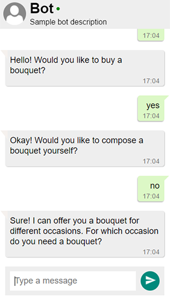

# 🤖 Chatbot-Bootstrap 🤖

## What is it?

A Chatbot Bootsrap-Kit based on [Meteor](https://github.com/meteor/meteor) and [MongoDB](https://www.mongodb.com). 
We have seen a lot of bot platforms and frameworks right? But what about a fully customizable, transparent and open source chatbot platform? 
This is exactly what this project is for.
It's a simple web-project which is pretty easy to get up and running. It currently offers API interfaces for API.ai and motion.ai. 
In addition it has a built in tracking view where you can see all recent conversations.

Try out my personal implementation here: http://adriankrebs.ch

---

## Table of Contents

- [What is it?](#what-is-it)
- [Getting started](#getting-started)
- [Contributing](#contributing)

---

## Getting started

1. Add NLP API-keys to the `settings.json` file 
2. Customize your dialog with buttons, avatar or other styling
3. `meteor --settings settings.json`
4. go to `localhost:3000` and start chatting :)

### NLP Engines
To make a chatbot work you need to connect to a NLP engine. I highly recommend the usage of API.ai:
- [API.ai tutorial](https://docs.api.ai/docs/profile-bot-example-agent)
- [API.ai floral shop sample (used for the screenshots)](https://docs.api.ai/docs/guidelines-contexts)

For very basic dialog structures you could even create your own .json file containing the conversation tree.

### Input Templates
By default the text input is enabled. You can customize the input template according to your needs.
- Type 'show buttons' to see how the button input template looks like.
- Check for the api.ai intent name if you would like to display your buttons only for certain intents.

### Tracking View

The built in tracking view offers a nice way to track all the conversations with the bot.
just go to `localhost:3000/tracking`

### Deployment on heroku

To deploy your bot on heroku I suggest using the [Meteor Buildpack Horse](https://github.com/AdmitHub/meteor-buildpack-horse)

## Contributing

Please fork this repository and contribute back using pull requests.

Any contributions are welcomed and appreciated.

I hope this helps you in building your next chatbot.

Follow me here on Github or on Twitter [@adrian_krebs](https://twitter.com/krebs_adrian) to stay up-to-date about chatbots and their rapid evolving technologies like AI, machine learning and natural language processing.

## License

MIT License (MIT). Copyright (c) 2017 Adrian Krebs.
